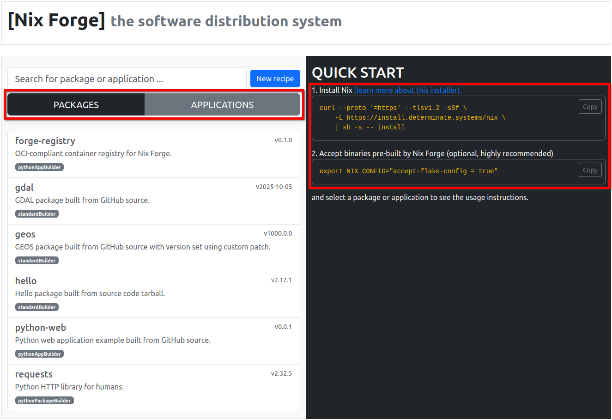
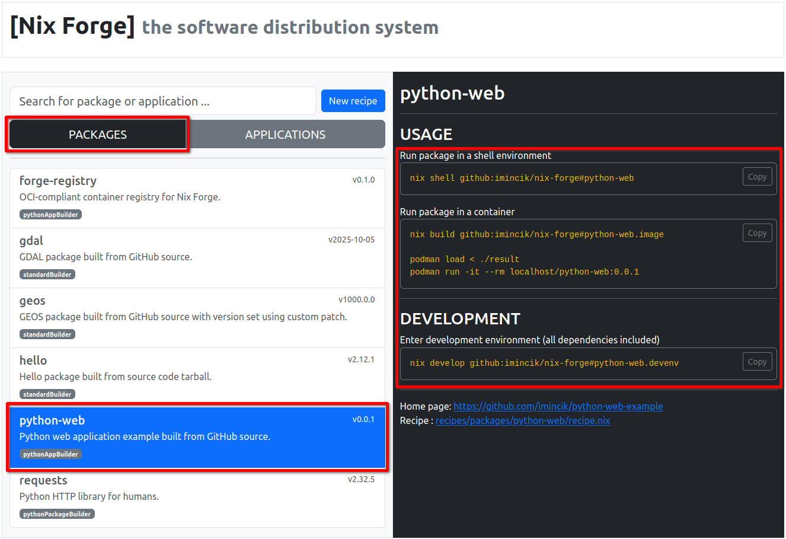
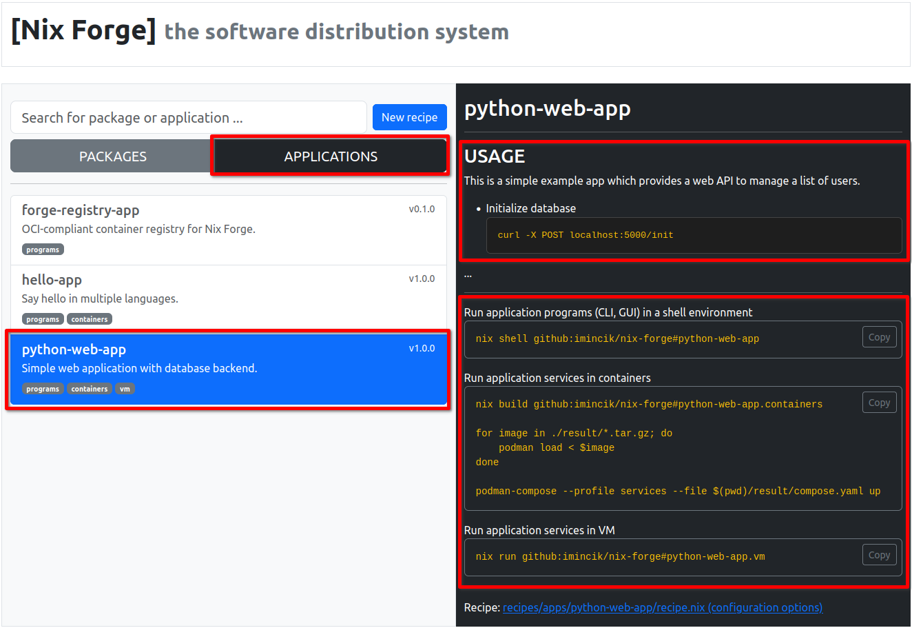
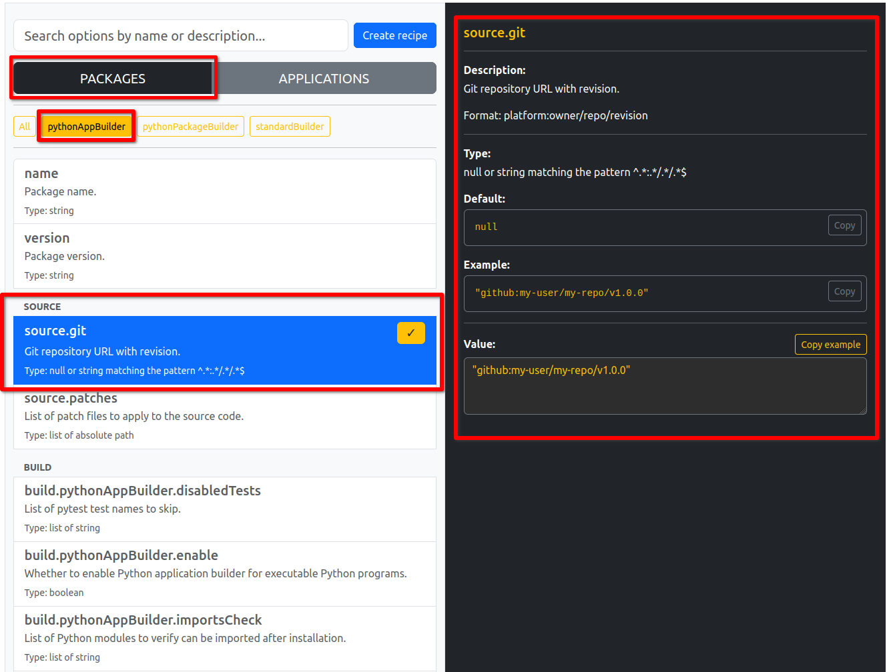
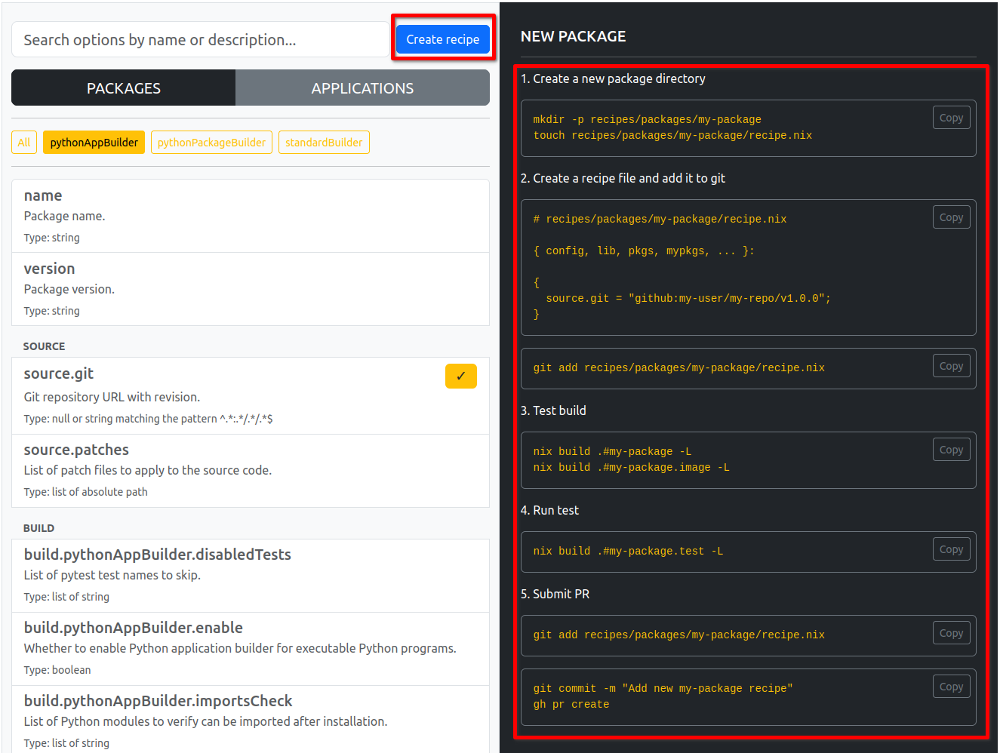

# Nix Forge
## Become a Nix smith over the weekend

FOSDEM, Brussels, Belgium, 2026

**Ivan Mincik, @imincik**

---

## Ivan Mincik, @imincik

* Nix Geospatial Team

* Nix@NGI Team

* Nix/NixOS consulting services

---

## Nix Forge

Simple software **packaging**, **distribution** and **deployment** with Nix

---

## User interface

---


---



---




---

## Packaging

---

### Name, version, source

```nix
name = "python-web";
version = "0.0.1";
description = "Python web application example built from GitHub source.";
homePage = "https://github.com/imincik/python-web-example";
mainProgram = "python-web";

source = {
  git = "github:imincik/python-web-example/v0.0.1";
  hash = "sha256-nSW5746+criXHPrxmJ+0zhJCMwl78eer03qQAvDIo5U=";
};
```

---

### Choose builder

* **standardBuilder** - autotools, Makefile, CMake

* **pythonPackageBuilder** - Python modules

* **pythonAppBuilder** - Python apps

---

### Build recipe

```nix
build.pythonAppBuilder = {
  enable = true;

  requirements.build-system = [
    pkgs.python3Packages.setuptools
  ];

  requirements.dependencies = [
    pkgs.python3Packages.flask
    pkgs.python3Packages.psycopg2
  ];
};

# Advanced
build.extraDrvAttrs = { };
```

---

## Multi-component applications

---

### Name, version, description, usage

```nix
  name = "python-web-app";
  version = "1.0.0";
  description = "Simple web application with database backend.";
  usage = ''
    Instructions how to use your app in markdown format.
  '';
```

---

### 1. Programs (shell environment) - CLI or GUI

```nix
programs = {
  enable = true;

  requirements = [
    pkgs.gdal
    pkgs.qgis
  ];
};
```

---

### 2. Containers - services

```nix
containers = {
  enable = true;

  images = [
    {
      name = "api";
      requirements = [ pkgs.mypkgs.python-web ];
      config.CMD = [ "python-web" ];
    }
    # ...
  ];

  composeFile = ./compose.yaml;
};
```

---

### 3. NixOS VM - services

```nix
vm = {
  enable = true;

  name = "database";

  config.system = {
    services.postgresql.enable = true;
    systemd.services.api.script = "${pkgs.mypkgs.python-web}/bin/python-web";
    systemd.services.api.wantedBy = [ "multi-user.target" ];
  };

  config.ports = [ "5000:5000" ];
};
```

---

## Creating recipes

---

### Using LLM (Claude)

```text
Based on instructions in AGENTS.md file, analyze the source code located in
<SOURCE-CODE-LOCATION> and create a Nix Forge package and application recipes.
```

---

### Using web UI

---



---



---

## Deployment

---

## Nix Forge Container Registry

<div style="text-align: left;">
Podman
</div>

```bash
podman run registry.imincik.app:6443/applications/hello-app/hello-english:latest
```

<div style="text-align: left;">
Kubernetes
</div>

```bash
kubectl run python-web --image=registry.imincik.app:6443/applications/hello-app/hello-english:latest
```

WARNING: this software is in a prototype state

---

## Self hosting

```bash
nix flake init --template "github:imincik/nix-forge#example"
```

---

* **https://forge.imincik.app**

* **https://www.imincik.com**
