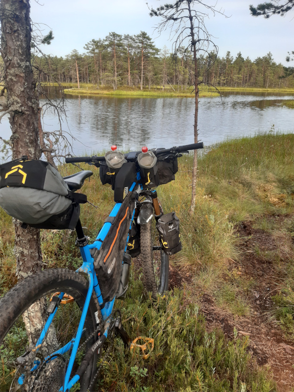
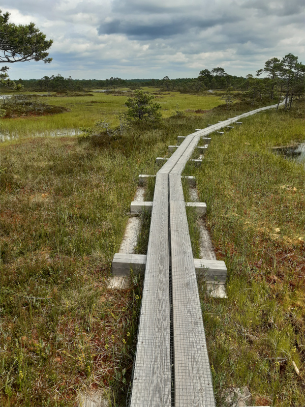
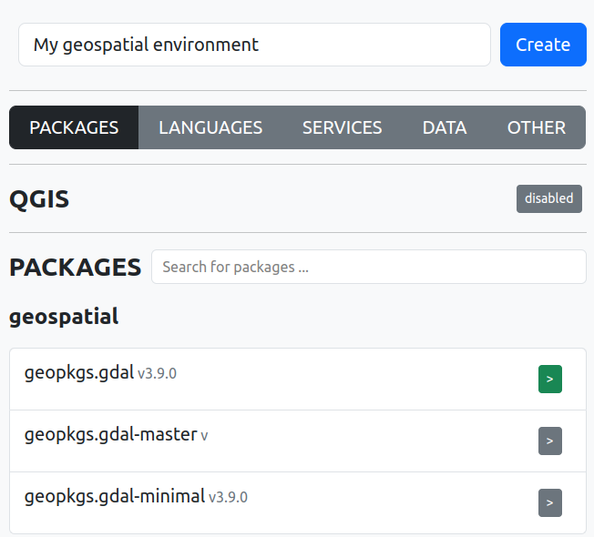

# Using Nix to build and distribute a geospatial software

FOSS4G Europe 2024, Tartu, Estonia, 2024

**Ivan Mincik, @imincik**, Nix Geospatial Team


---



---



---

A talk about **inovative ways of running a software** on a computer.

---

## Type of geospatial software

* Core libraries (C, C++) + addons

* Python/R/Other libraries

* Desktop apps + plugins/addons

* Databases + extensions

* Web services + plugins

* CLIs

---

## User expectations

* Run **any** of software on **any machine**

* Run any software **without breaking another one**

* Freedom to decide **when to update** or **not to update** at all

---

## User expectations

* Be able to **reproduce installation** on **any machine** at **any time**

---

## Advanced user expectations

* Have a **full control of whole dependency graph**

* Be able to **customize the software** including **dependencies**

---

## Developer expectations

* Be able to **start hacking** without too much effort

* Have a **quick** and **reliable feedback loop** with the users and other developers

---

## From source to user

**Source code** -> **Package** -> **Repository** -> **User**

  (devs) -> (package maintainers) -> (users)

_Deb, RPM, PPA, AUR, Conda, Hombrew, Flatpak, AppImage, Snap, Pip, Npm, OSGeo4W, Chocolatey, Docker, ..._

---

## Problems

* **Delivery** of software **depends on package maintainers**

---

## Problems

* Big **duplication of package maintainers work**

* All solutions are **missing some packages**

---

## Problems

* **Breakages when combining** multiple solutions/sources

* **Software inconsistencies** when combining multiple solutions/sources

---

## Problems

* Some solutions are **platform/distro specific**

* Some solutions **don't allow to install multiple versions** of software

* Some solutions depend on **proprietary** components

* Some solutions are **just workarounds** (containers for running GUI)

---

## Nix

**Ground-up design**, not following known **broken patterns.**

*(E. Dolstra, PhD theses, 2006)*

---

## Features of Nix

* **Reproducibility** as a core feature:

  * between multiple builds
  * between multiple machines
  * over the time

* **Full control** over whole **dependency graph**

* **No software conflicts**

* Runs on **all Linux, Mac, Win WSL 2**

---

## Features of Nix

* Per-project **isolated environments** for **all types of software**

* Software versions are **locked** and **updated when requested**

* Great **customization support**

* Dozens of other **very unique features**

---

## What is Nix ?

* **Nix** - the package manager/build system

* **Nix** - the language

* **Nixpkgs** - the largest packages repo

* **Nix modules system** - the declarative configuration management

* **NixOS** - the unique operating system

*\+ dozens of other community projects (Home Manager, ..)*

---

# DEMO

(magic Nix commands)

---

## Nix for users

---

## Run GRASS

* No GRASS installed

  ```bash
  $ grass

  The program 'grass' is not in your PATH.
  ```

* Run GRASS from Internet repo (geospatial-nix)

  ```bash
  $ nix run github:imincik/geospatial-nix#grass -- --version

  GRASS GIS 8.3.2
  ```

---

## Run GRASS (other version)

* Run GRASS in other version

  ```bash
  $ nix run github:imincik/geospatial-nix/58d8cff#grass -- --version

  GRASS GIS 8.3.1
  ```

---

## Install GRASS

* Install GRASS

  ```bash

  $ nix profile install github:imincik/geospatial-nix#grass
  ```

---

## Shell environment

* No QGIS installed

  ```bash
  $ qgis

  The program 'qgis' is not in your PATH.
  ```

* Create shell environment with GRASS and QGIS

  ```bash
  $ nix shell github:imincik/geospatial-nix#{grass,qgis}

  $ grass --version
  GRASS GIS 8.3.2

  $ qgis --version
  QGIS 3.36.3-Maidenhead 'Maidenhead' (exported)
  ```

---

## Exit shell environment

* Exit shell environment

  ```bash
  $ exit  # no grass and qgis anymore :(
  ```

---

## Nix for advanced users

---

## GRASS customization (override dependencies)

* Build with development version of GDAL

  ```bash
  $ nix run -L --impure --expr \
    "let \
      f = builtins.getFlake "github:imincik/geospatial-nix"; \
      p = f.packages.x86_64-linux; \

    in p.grass.override { gdal = p.gdal-master; }"
  ```

  ```bash
  $ g.version -e

  GRASS 8.3.2 (2024)
  PROJ: 9.4.1
  GDAL/OGR: 3.10.0dev
  GEOS: 3.12.1
  SQLite: 3.43.2
  ```

---

## GRASS customization (modify build configuration)

* Build without X support

  ```bash
  $ nix run -L --impure --expr \
    "let \
      f = builtins.getFlake "github:imincik/geospatial-nix"; \
      p = f.packages.x86_64-linux; \

    in p.grass.overrideAttrs (old: { configureFlags = old.configureFlags ++ [ "--without-x" ]; })"
  ```

---

## GRASS customization (add patch)

* Build with patch from PR

  ```nix
    p.grass.overrideAttrs (_: { patches = [
        n.fetchpatch {
          url = "https://github.com/<OWNER>/<REPO>/commit/<GIT-REVISION>.patch";
          hash = "";
        }
    ]})
  ```

---

## GRASS in container

* Nix is a better Docker image builder than Docker

  ```bash
  $ nix build --impure --expr \
    "let \
      f = builtins.getFlake "github:imincik/geospatial-nix"; \
      p = f.packages.x86_64-linux; \
      n = f.inputs.nixpkgs.legacyPackages.x86_64-linux; \

    in n.dockerTools.buildImage \
      { name = "grass"; config.Cmd = [ "${p.grass}/bin/grass" "--version" ]; }"

  ```
  ```bash
  $ docker load < ./result

  $ docker run grass:<TAG>

  GRASS GIS 8.3.2
  ```

---

## Nix for developers

---

## PR: Add Nix files to the project

  * flake.nix
  * flake.lock
  * package.nix

---

## GRASS development environment

* Get GRASS source code

  ```bash
  $ git clone https://github.com/OSGeo/grass.git
  ```

* Build GRASS from source

  ```bash
  $ nix develop

  Welcome to a GRASS development environment !
  Build GRASS using following commands:

   1.  ./configure --prefix=$(pwd)/app
   2.  make -j16
   3.  make install

  ...
  ```

  ```bash
  $ ./configure

  $ make -j8
  ```

---

## Run GRASS directly from source code

* Run latest development version

  ```bash

  $ nix run github:OSGeo/grass/#grass -- --version
  ```

* Run specific git revision

  ```bash

  $ nix run github:OSGeo/grass/<GIT-REVISION>#grass -- --version
  ```

* Run from PR

  ```bash

  $ nix run github:OSGeo/grass/<PR-BRANCH>#grass -- --version
  ```

---

## Install GRASS directly from source code

* Run latest development version

  ```bash

  $ nix profile install github:OSGeo/grass/#grass -- --version
  ```

* Run specific git revision

  ```bash

  $ nix profile install github:OSGeo/grass/<GIT-REVISION>#grass -- --version
  ```

* Run from PR

  ```bash

  $ nix profile install github:OSGeo/grass/<PR-BRANCH>#grass -- --version
  ```

---

## Interested ?

* Matrix: #geospatial:nixos.org

* Email: ivan.mincik@gmail.com

---

# Geospatial NIX.today



---

## Geospatial NIX.today

https://geospatial-nix.today/

---

## Nix documentation

https://nix.dev/
