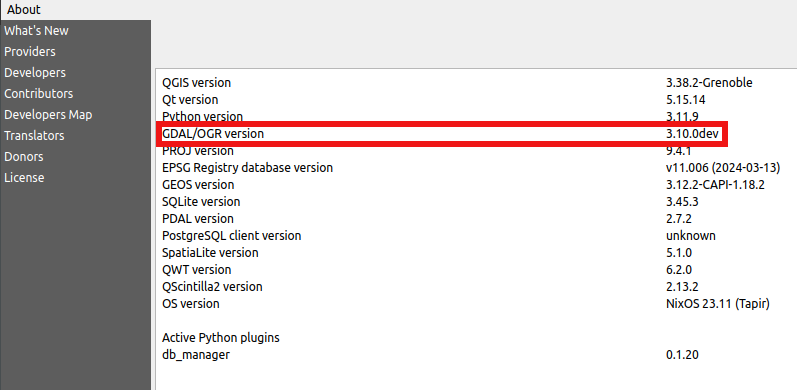

# Advantages of QGIS environment powered by Nix

QGIS User Conference, Bratislava, Slovakia, 2024

**Ivan Mincik, @imincik**

---

## About me

---


---

* Nix Geospatial Team

* https://geospatial-nix.today 

---

## My talk

**Inovative ways of running a software** on a computer.

---

## Geospatial software ecosystem

* Core libraries (C, C++) + addons

* Python/R/Other libraries

* Databases + extensions

* Web services + plugins

* CLI tools

---

## Geospatial software ecosystem

* Non-geospatial libraries (QT, SIP, ...)

---

## Geospatial software ecosystem

* GRASS + addons

* QGIS + plugins

* Other ...
---

## User expectations

* Run **any** of software on **any machine**

* Run any software **without breaking another one**

* Freedom to decide **when to update** or **not to update** at all

---

## User expectations

* Be able to **reproduce installation** on **any machine** at **any time**

---

## Advanced user expectations

* Have a **full control of whole dependency graph**

* Be able to **customize the software** including **dependencies**

---

## Developer expectations

* Be able to **start hacking** without too much effort

* Have a **quick** and **reliable feedback loop** with the users and other developers

---

## The problem


_QGIS dependency graph._

---

## Nix

**Unique design**, not building on already known **broken patterns.**

*(E. Dolstra, PhD theses, 2006)*

---

## Features of Nix

* **Reproducibility** as a core feature:

  * between multiple builds
  * between multiple machines
  * over the time

* **Full control** over whole **dependency graph**

* **No software conflicts**

* Runs on **all Linux, Mac, Win WSL 2**

---

## Features of Nix

* Per-project **isolated environments** for **all types of software**

* Software versions are **locked** and **updated when requested**

* Great **customization support**

* Dozens of other **very unique features**

---

## What is Nix ?

Nix is the **computation engine** on file systems.

---

## What is Nix ?

Nix is a **pure**, **functional**, **lazy**, **declarative**, and **reproducible programming language**.

---

## What is Nix ?

* **Nixpkgs** - the largest packages repo

* **Nix modules system** - the declarative configuration management

* **NixOS** - the unique operating system

*\+ dozens of other community projects (Home Manager, ..)*

---

# DEMO

(magic Nix commands)

---

## Nix for users

---

## Run QGIS

* No QGIS installed

  ```bash
  $ qgis

  The program 'qgis' is not in your PATH.
  ```

* Run QGIS from Internet repo (geospatial-nix)

  ```bash
  $ nix run github:imincik/geospatial-nix#qgis -- --version

  QGIS 3.38.2-Grenoble 'Grenoble' (exported)
  ```

---

## Run QGIS (other version)

* Run QGIS in other version

  ```bash
  $ nix run github:imincik/geospatial-nix/2b66624#qgis -- --version

  QGIS 3.38.1-Grenoble 'Grenoble' (exported)
  ```

---

## Install QGIS

* Install QGIS

  ```bash

  $ nix profile install github:imincik/geospatial-nix#qgis
  ```

---

## Shell environment

* No QGIS installed

  ```bash
  $ qgis

  The program 'qgis' is not in your PATH.
  ```

* Create shell environment with GRASS and QGIS

  ```bash
  $ nix shell github:imincik/geospatial-nix#{grass,qgis}

  $ grass --version
  GRASS GIS 8.4.0

  $ qgis --version
  QGIS 3.38.2-Grenoble 'Grenoble' (exported)
  ```

---

## Exit shell environment

* Exit shell environment

  ```bash
  $ exit  # no grass and qgis anymore :(
  ```

---

## Nix for advanced users

---

## QGIS customization (override dependencies)

* Build with development version of GDAL

  ```bash
  $ nix run --impure --expr \
    "let f = builtins.getFlake "github:imincik/geospatial-nix";
      p = f.packages.x86_64-linux; \
      
    in p.qgis.override { qgis-unwrapped = p.qgis-unwrapped.override { gdal = p.gdal-master; }; }"
  ```
---

## QGIS customization (override dependencies)



---

## QGIS customization (modify build configuration)

* Build without 3D support

  ```bash
  $ nix run --impure --expr \
    "let f = builtins.getFlake "github:imincik/geospatial-nix";
      p = f.packages.x86_64-linux; \
      
    in p.qgis.override {
      qgis-unwrapped = p.qgis-unwrapped.overrideAttrs (
      old: { cmakeFlags = old.cmakeFlags ++ [ "-DWITH_3D=False" ]; }
    );}"
  ```

---

## QGIS customization (add patch)

* Build with patch from PR

  ```nix
    p.qgis-unwrapped.overrideAttrs (_: { patches = [
        n.fetchpatch {
          url = "https://github.com/<OWNER>/<REPO>/commit/<GIT-REVISION>.patch";
          hash = "";
        }
    ]})
  ```

---

## GRASS in container

* Nix is a better Docker image builder than Docker

  ```bash
  $ nix build --impure --expr \
    "let \
      f = builtins.getFlake "github:imincik/geospatial-nix"; \
      p = f.packages.x86_64-linux; \
      n = f.inputs.nixpkgs.legacyPackages.x86_64-linux; \

    in n.dockerTools.buildImage \
      { name = "grass"; config.Cmd = [ "${p.grass}/bin/grass" "--version" ]; }"

  ```
  ```bash
  $ docker load < ./result

  $ docker run grass:<TAG>

  GRASS GIS 8.4.0
  ```

---

## Nix for developers

---

## PR: Add Nix files to the project

https://github.com/qgis/QGIS/pull/58510

  * flake.nix
  * flake.lock
  * package.nix
  * unwrapped.nix

---

## QGIS development environment

* Get QGIS source code

  ```bash
  $ git clone https://github.com/qgis/QGIS.git
  ```

* Build QGIS from source

  ```bash
  $ nix develop

  Welcome to a QGIS development environment !
  Build QGIS using following commands:

   1.  cmake -G Ninja -D CMAKE_BUILD_TYPE=Debug -D CMAKE_INSTALL_PREFIX=$(pwd)/app ...
   2.  ninja
   3.  ninja install

  ...
  ```

---

## Run QGIS directly from source code

* Run latest development version

  ```bash

  $ nix run github:qgis/QGIS/#qgis-- --version
  ```

* Run specific git revision

  ```bash

  $ nix run github:qgis/QGIS/<GIT-REVISION>#qgis -- --version
  ```

* Run from PR

  ```bash

  $ nix run github:qgis/QGIS/<PR-BRANCH>#qgis -- --version
  ```

---

## Install QGIS directly from source code

* Install latest development version

  ```bash

  $ nix profile install github:qgis/qgis/#qgis -- --version
  ```

* Install specific git revision

  ```bash

  $ nix profile install github:qgis/QGIS/<GIT-REVISION>#qgis -- --version
  ```

* Install from PR

  ```bash

  $ nix profile install github:qgis/QGIS/<PR-BRANCH>#qgis -- --version
  ```

---

## Issues with QGIS

* Doesn't work on Darwin (yet)

* Failing test suite

* GPU drivers not available out-of-box

---

## Geospatial NIX.today

https://geospatial-nix.today/

---

## Interested ?

* https://nixos.org/community/teams/geospatial/

* Matrix: #geospatial:nixos.org

* Email: ivan.mincik@gmail.com

---

## Nix documentation

https://nix.dev/
